# Sky Take-Out 🍽️

A comprehensive food delivery platform built with Spring Boot backend, Vue.js admin panel, and WeChat Mini Program for customers. This full-stack solution provides complete restaurant management and online ordering capabilities.

## 📸 Project Screenshots

### System Overview
<div align="center">
  
  <p><em>Technology Stack Overview</em></p>
</div>

<div align="center">
  
  <p><em>Management and Customer Interface Overview</em></p>
</div>


<div align="center">
  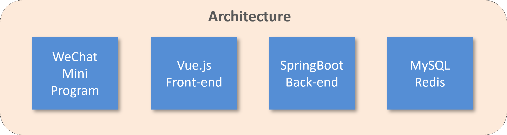
  <p><em>System Architecture Overview</em></p>
</div>

## 🛠️ Tech Stack

### Backend
- **Framework**: Spring Boot 2.7.3
- **Database**: MySQL 8.0 + MyBatis
- **Cache**: Redis 6.2
- **Security**: JWT Authentication
- **Payment**: WeChat Pay Integration
- **Documentation**: Knife4j (Swagger)
- **Build Tool**: Maven

### Frontend - Admin Panel
- **Framework**: Vue.js 2.6 + TypeScript
- **UI Library**: Element UI
- **Charts**: ECharts
- **HTTP Client**: Axios
- **Build Tool**: Vue CLI

### Frontend - Customer App
- **Framework**: UniApp (Cross-platform)
- **Target**: WeChat Mini Program
- **State Management**: Vuex
- **UI Components**: Uni-UI

### DevOps & Deployment
- **Containerization**: Docker + Docker Compose
- **Reverse Proxy**: Nginx
- **Environment**: Multi-environment support

## 🚀 Features

### 👨‍💼 Admin Management Panel
- **Dashboard**: Real-time business analytics and statistics
- **Employee Management**: Staff accounts and role management
- **Category Management**: Food category organization
- **Dish Management**: Menu items with images and descriptions
- **Set Meal Management**: Combo meal configurations
- **Order Management**: Order processing and status tracking
- **Reports**: Sales reports and data export

### 📱 Customer Mini Program
- **User Authentication**: WeChat OAuth integration
- **Menu Browsing**: Category-based food browsing
- **Shopping Cart**: Add/remove items with real-time updates
- **Order Placement**: Multiple payment options
- **Order Tracking**: Real-time order status updates
- **Address Management**: Multiple delivery addresses
- **Order History**: Past order reviews and reordering

<div align="center">
  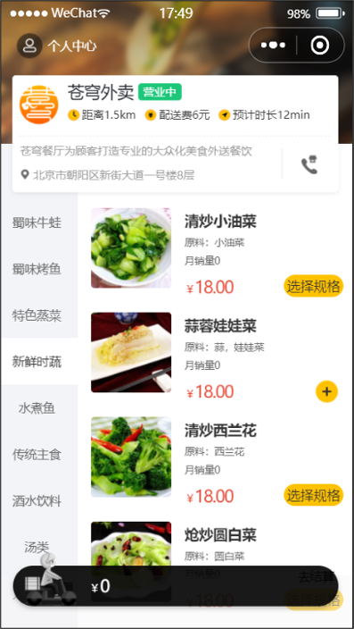
  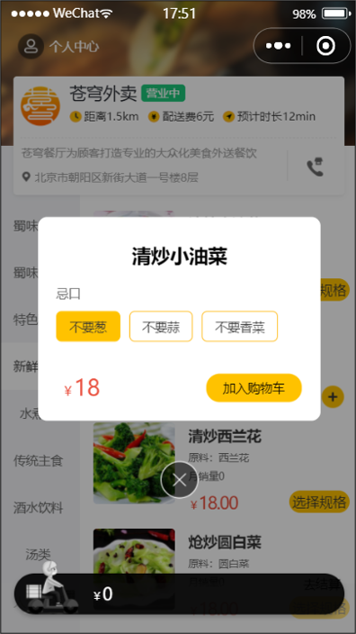
  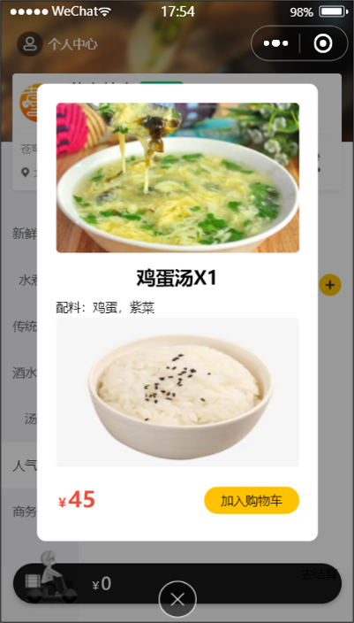
</div>

<div align="center">
  <em>WeChat Mini Program User Interface</em>
</div>

### 🔧 Core Features
- **Real-time Notifications**: WebSocket for live updates
- **Payment Processing**: Secure WeChat Pay integration
- **File Upload**: Image management for dishes
- **Caching Strategy**: Redis for performance optimization
- **Data Validation**: Comprehensive input validation
- **Exception Handling**: Centralized error management

## 🖥️ Admin Panel Screenshots

### Login & Dashboard
<div align="center">
  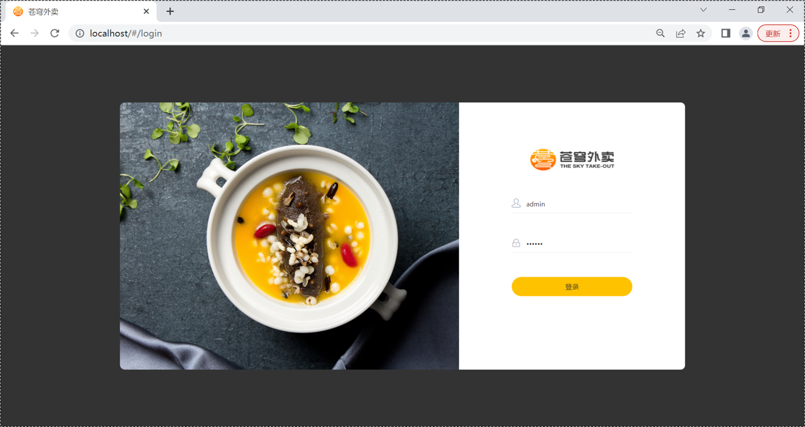
  <p><em>Admin Login Interface</em></p>
</div>

<div align="center">
  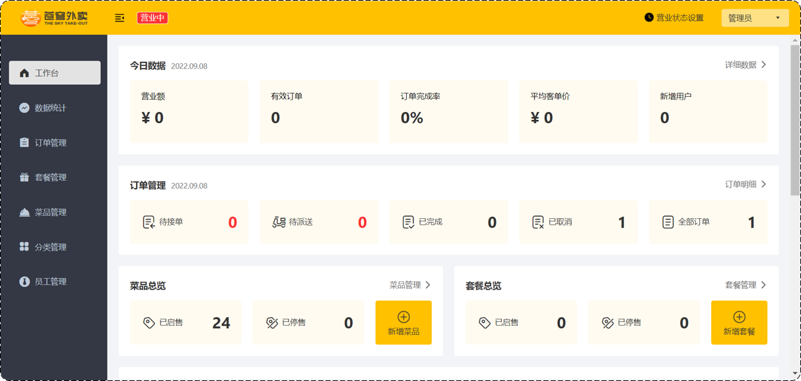
  <p><em>Real-time Business Dashboard</em></p>
</div>

### Data Analytics
<div align="center">
  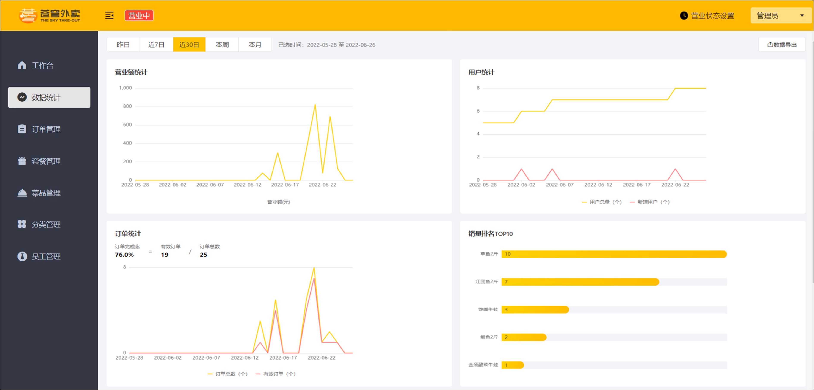
  <p><em>Business Statistics and Reports</em></p>
</div>

### Menu Management
<div align="center">
  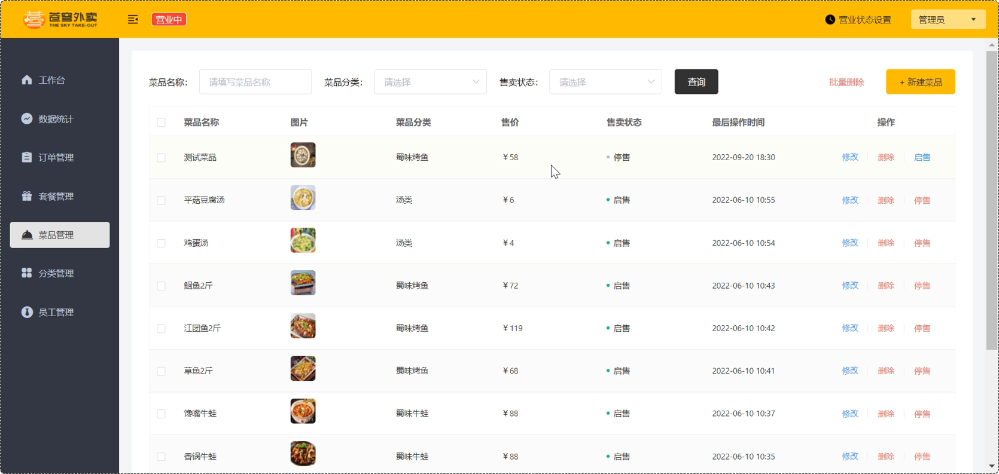
  <p><em>Dish Management Interface</em></p>
</div>

<div align="center">
  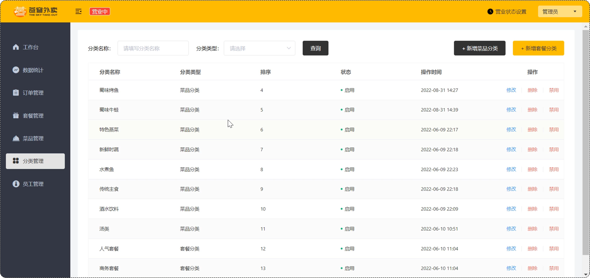
  <p><em>Category Management System</em></p>
</div>

## 💳 WeChat Pay Integration

<div align="center">
  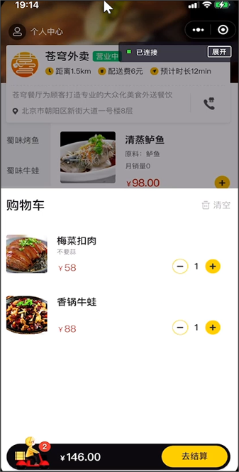
  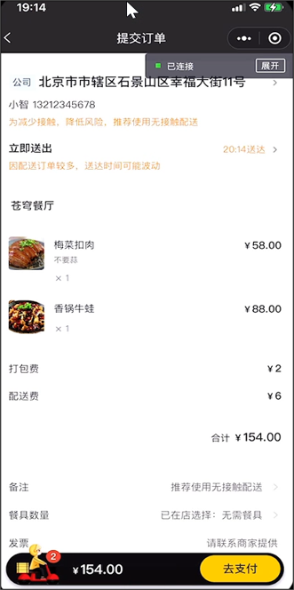
  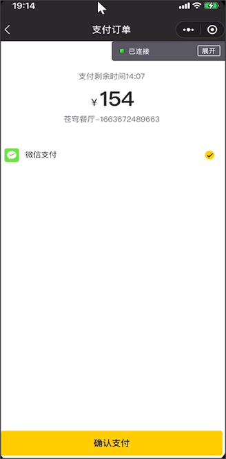
  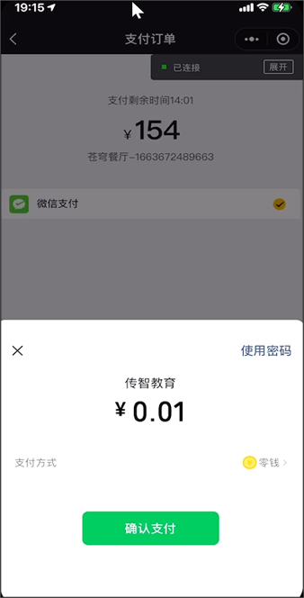
  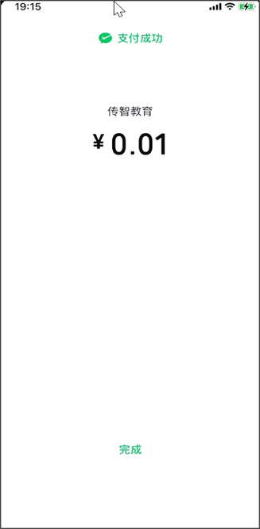
</div>

<div align="center">
  <em>Complete WeChat Payment Process Flow</em>
</div>

## 📦 Project Structure

```
sky-take-out/
├── sky-server/                          # Spring Boot Backend
│   ├── src/main/java/com/sky/
│   │   ├── controller/                  # REST API Controllers
│   │   ├── service/                     # Business Logic Layer
│   │   ├── mapper/                      # MyBatis Data Access
│   │   ├── entity/                      # JPA Entities
│   │   ├── dto/                         # Data Transfer Objects
│   │   ├── vo/                          # View Objects
│   │   ├── config/                      # Configuration Classes
│   │   ├── interceptor/                 # Request Interceptors
│   │   └── utils/                       # Utility Classes
│   └── src/main/resources/
│       ├── application.yml              # Application Configuration
│       └── mapper/                      # MyBatis XML Mappers
├── sky-common/                          # Common Utilities
│   └── src/main/java/com/sky/
│       ├── constant/                    # Application Constants
│       ├── exception/                   # Custom Exceptions
│       ├── properties/                  # Configuration Properties
│       └── utils/                       # Shared Utilities
├── sky-pojo/                           # Entity Classes
│   └── src/main/java/com/sky/
│       ├── entity/                      # Database Entities
│       ├── dto/                         # Request DTOs
│       └── vo/                          # Response VOs
├── project-sky-admin-vue-ts/           # Vue.js Admin Panel
│   ├── src/
│   │   ├── api/                         # API Service Layer
│   │   ├── components/                  # Reusable Components
│   │   ├── views/                       # Page Components
│   │   ├── store/                       # Vuex State Management
│   │   ├── router/                      # Vue Router Configuration
│   │   └── styles/                      # Global Styles
│   └── package.json
├── project-rjwm-weixin-uniapp-develop-wsy/  # WeChat Mini Program
│   ├── pages/                           # Mini Program Pages
│   ├── components/                      # Custom Components
│   ├── utils/                           # Utility Functions
│   ├── store/                           # State Management
│   └── manifest.json                    # App Configuration
├── docker-compose.yml                   # Container Orchestration
├── nginx.conf                          # Nginx Configuration
└── pom.xml                             # Maven Parent POM
```

## 🌟 Key Highlights

- **Microservice Architecture**: Modular design with clear separation of concerns
- **Real-time Features**: WebSocket integration for live order updates
- **Mobile-First**: WeChat Mini Program for seamless mobile experience
- **Scalable Design**: Redis caching and optimized database queries
- **Payment Integration**: Secure WeChat Pay implementation
- **Comprehensive Admin**: Full-featured management dashboard
- **Docker Ready**: Containerized deployment for easy scaling

---

**Built with ❤️ for the food delivery industry**